# HuLa 功能架构设计流程图

## 1. 用户认证与授权流程

### 1.1 用户登录流程

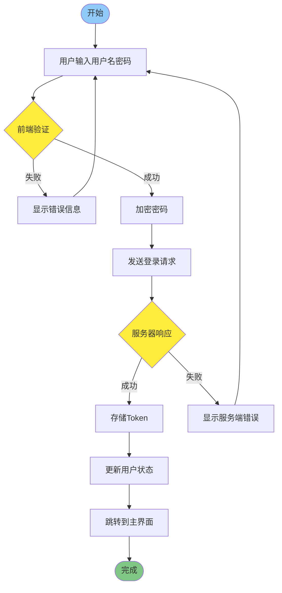
```mermaid
flowchart TD
    Start([开始]) --> Input[用户输入用户名密码]
    Input --> Validate{前端验证}
    Validate -->|失败| ShowError[显示错误信息]
    ShowError --> Input

    Validate -->|成功| Encrypt[加密密码]
    Encrypt --> Request[发送登录请求]
    Request --> Response{服务器响应}

    Response -->|成功| StoreToken[存储Token]
    Response -->|失败| ShowServer[显示服务端错误]
    ShowServer --> Input

    StoreToken --> UpdateUser[更新用户状态]
    UpdateUser --> Navigate[跳转到主界面]
    Navigate --> End([完成])

    style Start fill:#90caf9
    style End fill:#81c784
    style Validate fill:#ffeb3b
    style Response fill:#ffeb3b
```

### 1.2 Token 刷新机制

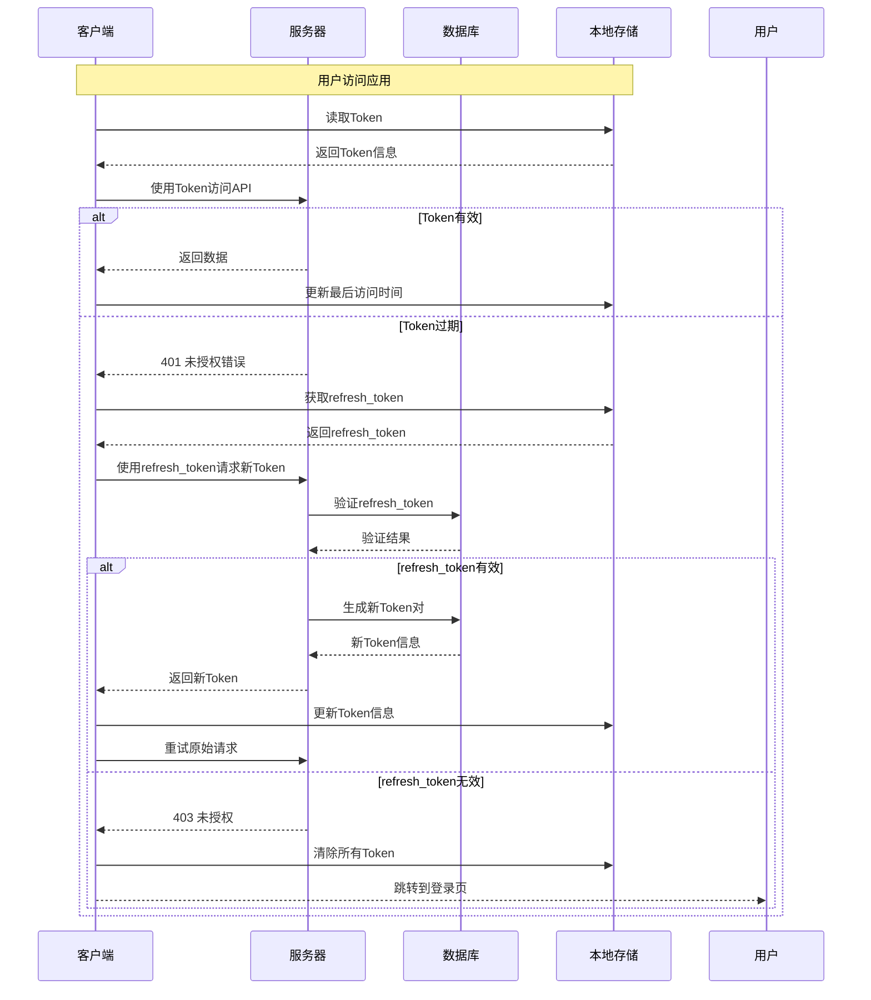
```mermaid
sequenceDiagram
    participant C as 客户端
    participant S as 服务器
    participant DB as 数据库
    participant Store as 本地存储

    Note over C,Store: 用户访问应用
    C->>Store: 读取Token
    Store-->>C: 返回Token信息
    C->>S: 使用Token访问API

    alt Token有效
        S-->>C: 返回数据
        C->>Store: 更新最后访问时间
    else Token过期
        S-->>C: 401 未授权错误
        C->>Store: 获取refresh_token
        Store-->>C: 返回refresh_token
        C->>S: 使用refresh_token请求新Token
        S->>DB: 验证refresh_token
        DB-->>S: 验证结果

        alt refresh_token有效
            S->>DB: 生成新Token对
            DB-->>S: 新Token信息
            S-->>C: 返回新Token
            C->>Store: 更新Token信息
            C->>S: 重试原始请求
        else refresh_token无效
            S-->>C: 403 未授权
            C->>Store: 清除所有Token
            C-->>用户: 跳转到登录页
        end
    end
```

### 1.3 二维码登录流程

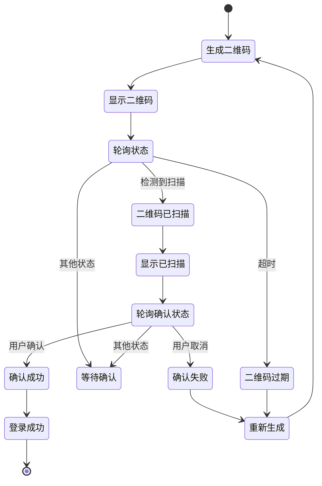
```mermaid
stateDiagram-v2
    [*] --> 生成二维码
    生成二维码 --> 显示二维码
    显示二维码 --> 轮询状态

    轮询状态 --> 二维码已扫描: 检测到扫描
    轮询状态 --> 二维码过期: 超时
    轮询状态 --> 等待确认: 其他状态

    二维码已扫描 --> 显示已扫描
    显示已扫描 --> 轮询确认状态

    轮询确认状态 --> 确认成功: 用户确认
    轮询确认状态 --> 确认失败: 用户取消
    轮询确认状态 --> 等待确认: 其他状态

    确认成功 --> 登录成功
    确认失败 --> 重新生成
    二维码过期 --> 重新生成

    登录成功 --> [*]
    重新生成 --> 生成二维码
```

## 2. 聊天功能流程

### 2.1 消息发送流程

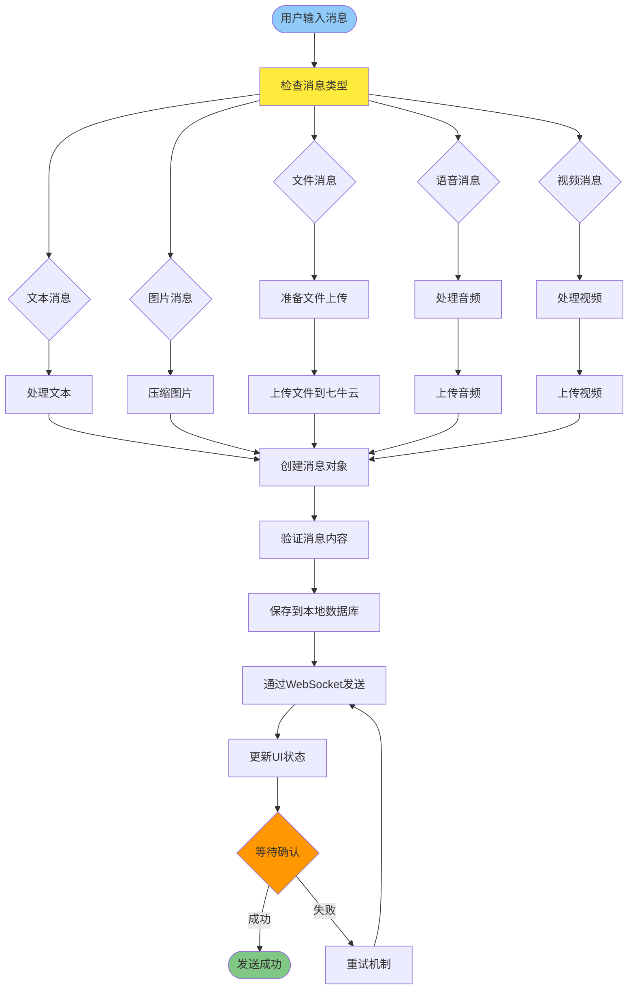
```mermaid
flowchart TD
    Start([用户输入消息]) --> Type[检查消息类型]

    Type --> Text{文本消息}
    Type --> Image{图片消息}
    Type --> File{文件消息}
    Type --> Audio{语音消息}
    Type --> Video{视频消息}

    Text --> ProcessText[处理文本]
    Image --> ProcessImage[压缩图片]
    File --> ProcessFile[准备文件上传]
    Audio --> ProcessAudio[处理音频]
    Video --> ProcessVideo[处理视频]

    ProcessText --> CreateMsg[创建消息对象]
    ProcessImage --> CreateMsg
    ProcessFile --> UploadFile[上传文件到七牛云]
    ProcessAudio --> UploadAudio[上传音频]
    ProcessVideo --> UploadVideo[上传视频]

    UploadFile --> CreateMsg
    UploadAudio --> CreateMsg
    UploadVideo --> CreateMsg

    CreateMsg --> ValidateMsg[验证消息内容]
    ValidateMsg --> SaveLocal[保存到本地数据库]
    SaveLocal --> SendWS[通过WebSocket发送]
    SendWS --> UpdateUI[更新UI状态]
    UpdateUI --> Ack{等待确认}

    Ack -->|成功| Success([发送成功])
    Ack -->|失败| Retry[重试机制]
    Retry --> SendWS

    style Start fill:#90caf9
    style Success fill:#81c784
    style Type fill:#ffeb3b
    style Ack fill:#ff9800
```

### 2.2 消息接收与处理

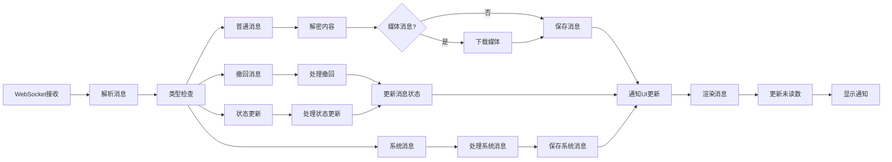
```mermaid
flowchart LR
    WS[WebSocket接收] --> Parse[解析消息]
    Parse --> TypeCheck[类型检查]

    TypeCheck --> Normal[普通消息]
    TypeCheck --> Recall[撤回消息]
    TypeCheck --> System[系统消息]
    TypeCheck --> Status[状态更新]

    Normal --> Decrypt[解密内容]
    Recall --> ProcessRecall[处理撤回]
    System --> ProcessSystem[处理系统消息]
    Status --> ProcessStatus[处理状态更新]

    Decrypt --> MediaCheck{媒体消息?}
    MediaCheck -->|是| Download[下载媒体]
    MediaCheck -->|否| SaveMsg[保存消息]

    Download --> SaveMsg
    ProcessRecall --> UpdateStatus[更新消息状态]
    ProcessSystem --> SaveSystem[保存系统消息]
    ProcessStatus --> UpdateStatus

    SaveMsg --> NotifyUI[通知UI更新]
    UpdateStatus --> NotifyUI
    SaveSystem --> NotifyUI

    NotifyUI --> Render[渲染消息]
    Render --> Unread[更新未读数]
    Unread --> Notification[显示通知]
```

### 2.3 群聊消息处理流程

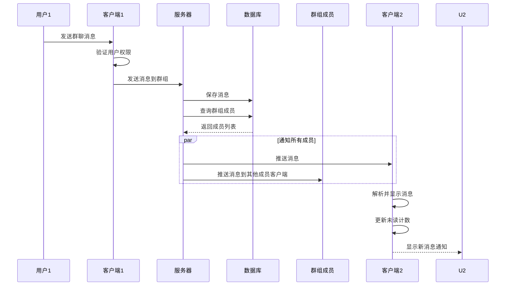
```mermaid
sequenceDiagram
    participant U1 as 用户1
    participant C1 as 客户端1
    participant S as 服务器
    participant DB as 数据库
    participant G as 群组成员
    participant C2 as 客户端2

    U1->>C1: 发送群聊消息
    C1->>C1: 验证用户权限
    C1->>S: 发送消息到群组
    S->>DB: 保存消息
    S->>DB: 查询群组成员
    DB-->>S: 返回成员列表

    par 通知所有成员
        S->>C2: 推送消息
        S->>G: 推送消息到其他成员客户端
    end

    C2->>C2: 解析并显示消息
    C2->>C2: 更新未读计数
    C2-->>U2: 显示新消息通知
```

## 3. 文件管理流程

### 3.1 文件上传流程

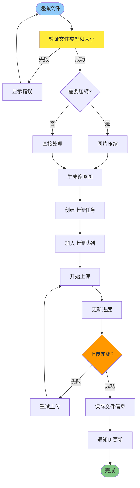
```mermaid
flowchart TD
    Select([选择文件]) --> Validate[验证文件类型和大小]
    Validate -->|失败| Error[显示错误]
    Validate -->|成功| Compress{需要压缩?}

    Compress -->|是| ImageCompress[图片压缩]
    Compress -->|否| Direct[直接处理]

    ImageCompress --> GenThumbnail[生成缩略图]
    Direct --> GenThumbnail

    GenThumbnail --> CreateTask[创建上传任务]
    CreateTask --> Queue[加入上传队列]
    Queue --> UploadStart[开始上传]

    UploadStart --> Progress[更新进度]
    Progress --> Complete{上传完成?}
    Complete -->|失败| RetryUpload[重试上传]
    Complete -->|成功| SaveInfo[保存文件信息]

    RetryUpload --> UploadStart
    SaveInfo --> NotifyUI[通知UI更新]
    NotifyUI --> End([完成])

    Error --> Select

    style Select fill:#90caf9
    style End fill:#81c784
    style Validate fill:#ffeb3b
    style Complete fill:#ff9800
```

### 3.2 文件下载流程

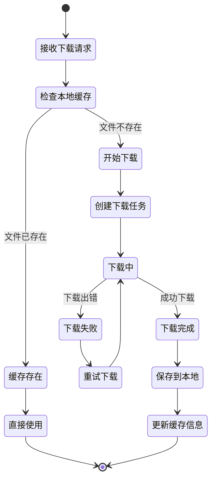
```mermaid
stateDiagram-v2
    [*] --> 接收下载请求
    接收下载请求 --> 检查本地缓存

    检查本地缓存 --> 缓存存在: 文件已存在
    检查本地缓存 --> 开始下载: 文件不存在

    缓存存在 --> 直接使用
    直接使用 --> [*]

    开始下载 --> 创建下载任务
    创建下载任务 --> 下载中
    下载中 --> 下载完成: 成功下载
    下载中 --> 下载失败: 下载出错

    下载失败 --> 重试下载
    重试下载 --> 下载中

    下载完成 --> 保存到本地
    保存到本地 --> 更新缓存信息
    更新缓存信息 --> [*]
```

### 3.3 文件共享流程

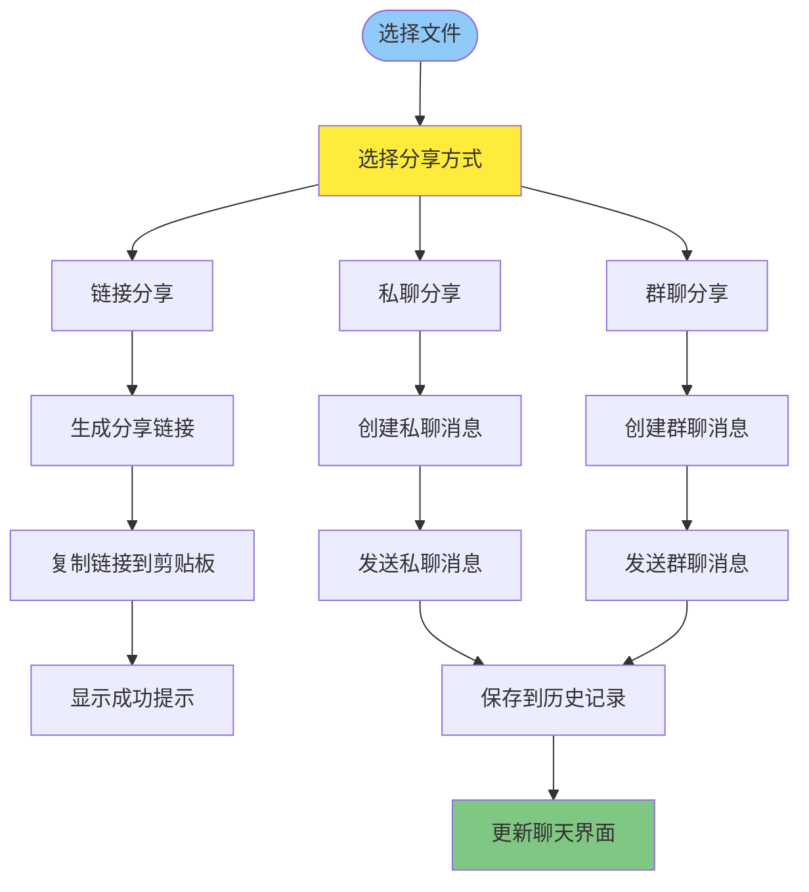
```mermaid
flowchart TD
    FileSelect([选择文件]) --> ShareType[选择分享方式]

    ShareType --> Private[私聊分享]
    ShareType --> Group[群聊分享]
    ShareType --> Link[链接分享]

    Private --> CreatePrivateMsg[创建私聊消息]
    Group --> CreateGroupMsg[创建群聊消息]
    Link --> GenLink[生成分享链接]

    CreatePrivateMsg --> SendPrivate[发送私聊消息]
    CreateGroupMsg --> SendGroup[发送群聊消息]

    GenLink --> CopyLink[复制链接到剪贴板]
    CopyLink --> ShowSuccess[显示成功提示]

    SendPrivate --> SaveHistory[保存到历史记录]
    SendGroup --> SaveHistory
    SaveHistory --> UpdateChat[更新聊天界面]

    style FileSelect fill:#90caf9
    style ShareType fill:#ffeb3b
    style UpdateChat fill:#81c784
```

## 4. 联系人管理流程

### 4.1 添加好友流程

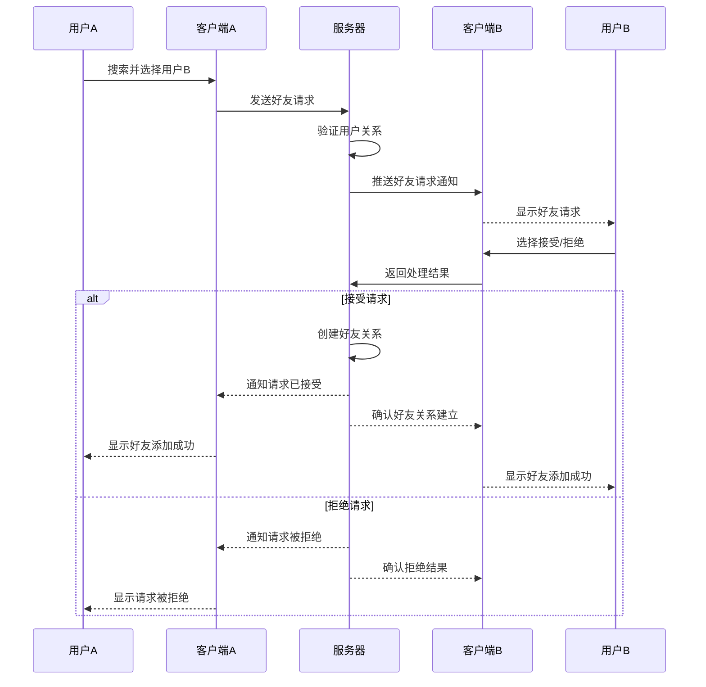
```mermaid
sequenceDiagram
    participant A as 用户A
    participant CA as 客户端A
    participant S as 服务器
    participant CB as 客户端B
    participant B as 用户B

    A->>CA: 搜索并选择用户B
    CA->>S: 发送好友请求
    S->>S: 验证用户关系
    S->>CB: 推送好友请求通知
    CB-->>B: 显示好友请求

    B->>CB: 选择接受/拒绝
    CB->>S: 返回处理结果

    alt 接受请求
        S->>S: 创建好友关系
        S-->>CA: 通知请求已接受
        S-->>CB: 确认好友关系建立
        CA-->>A: 显示好友添加成功
        CB-->>B: 显示好友添加成功
    else 拒绝请求
        S-->>CA: 通知请求被拒绝
        S-->>CB: 确认拒绝结果
        CA-->>A: 显示请求被拒绝
    end
```

### 4.2 群组管理流程

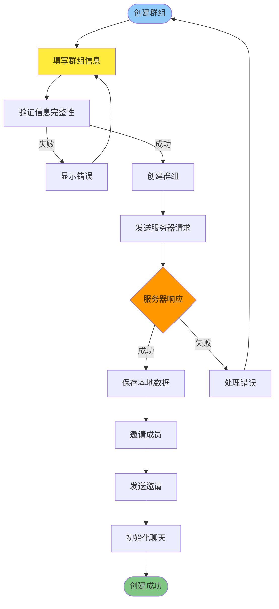
```mermaid
flowchart TD
    Start([创建群组]) --> GroupInfo[填写群组信息]
    GroupInfo --> ValidateInfo[验证信息完整性]
    ValidateInfo -->|失败| ShowError[显示错误]
    ValidateInfo -->|成功| CreateGroup[创建群组]

    CreateGroup --> ServerReq[发送服务器请求]
    ServerReq --> Response{服务器响应}

    Response -->|成功| SaveLocal[保存本地数据]
    Response -->|失败| ErrorHandle[处理错误]

    SaveLocal --> InviteMembers[邀请成员]
    InviteMembers --> SendInvites[发送邀请]
    SendInvites --> ChatInit[初始化聊天]
    ChatInit --> Success([创建成功])

    ErrorHandle --> Start
    ShowError --> GroupInfo

    style Start fill:#90caf9
    style Success fill:#81c784
    style GroupInfo fill:#ffeb3b
    style Response fill:#ff9800
```

## 5. AI 助手功能流程

### 5.1 AI 对话流程

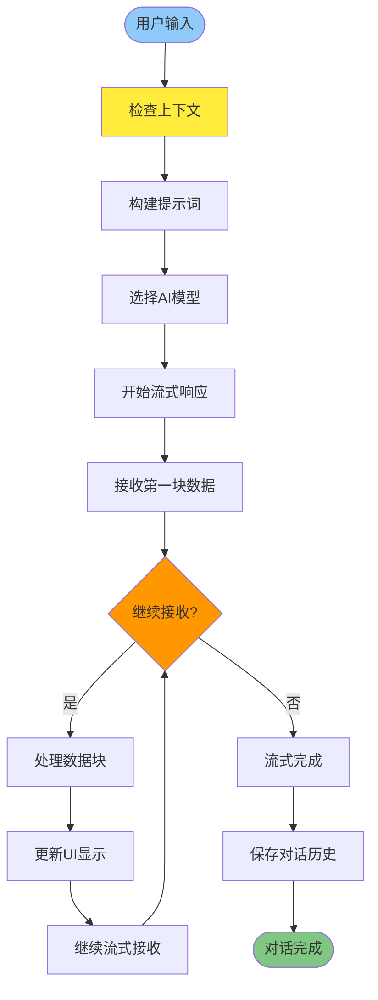
```mermaid
flowchart TD
    UserInput([用户输入]) --> ContextCheck[检查上下文]
    ContextCheck --> BuildPrompt[构建提示词]
    BuildPrompt --> SelectModel[选择AI模型]

    SelectModel --> StreamStart[开始流式响应]
    StreamStart --> FirstChunk[接收第一块数据]
    FirstChunk --> Continue{继续接收?}

    Continue -->|是| ProcessChunk[处理数据块]
    ProcessChunk --> UpdateUI[更新UI显示]
    UpdateUI --> StreamContinue[继续流式接收]
    StreamContinue --> Continue

    Continue -->|否| StreamComplete[流式完成]
    StreamComplete --> SaveHistory[保存对话历史]
    SaveHistory --> Complete([对话完成])

    style UserInput fill:#90caf9
    style Complete fill:#81c784
    style ContextCheck fill:#ffeb3b
    style Continue fill:#ff9800
```

### 5.2 多模态AI生成流程

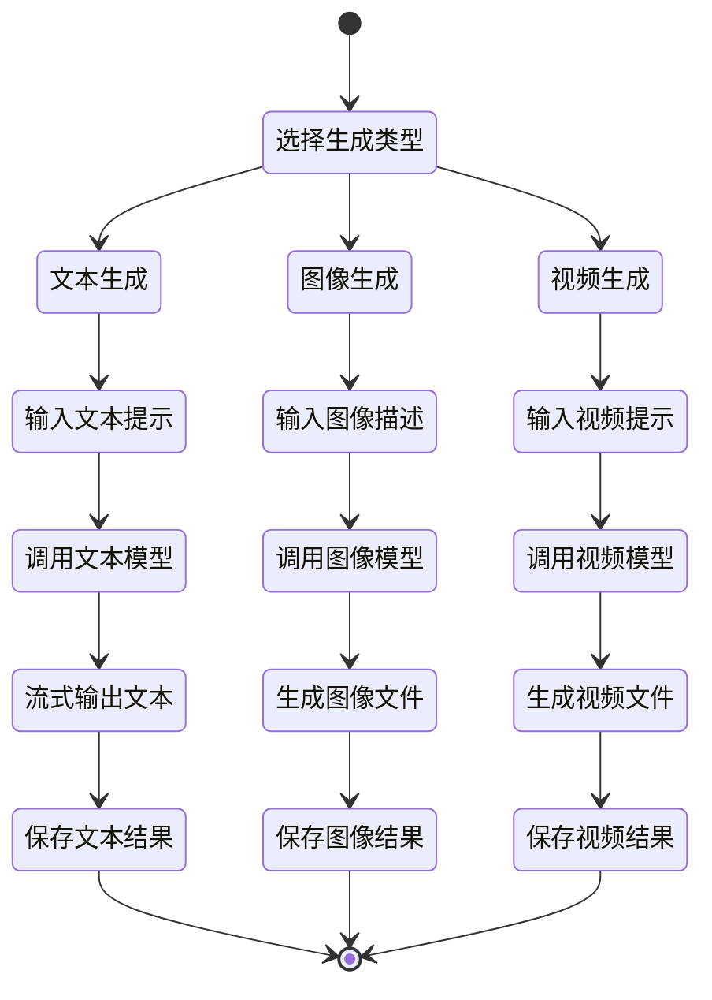
```mermaid
stateDiagram-v2
    [*] --> 选择生成类型
    选择生成类型 --> 文本生成
    选择生成类型 --> 图像生成
    选择生成类型 --> 视频生成

    文本生成 --> 输入文本提示
    图像生成 --> 输入图像描述
    视频生成 --> 输入视频提示

    输入文本提示 --> 调用文本模型
    输入图像描述 --> 调用图像模型
    输入视频提示 --> 调用视频模型

    调用文本模型 --> 流式输出文本
    调用图像模型 --> 生成图像文件
    调用视频模型 --> 生成视频文件

    流式输出文本 --> 保存文本结果
    生成图像文件 --> 保存图像结果
    生成视频文件 --> 保存视频结果

    保存文本结果 --> [*]
    保存图像结果 --> [*]
    保存视频结果 --> [*]
```

## 6. 设置与配置流程

### 6.1 主题切换流程

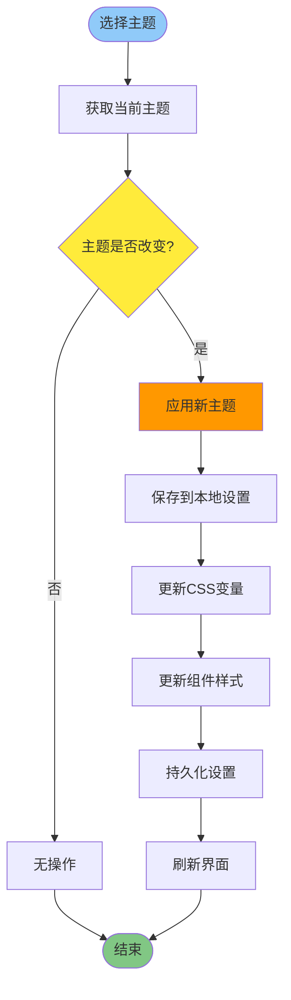
```mermaid
flowchart TD
    ThemeSelect([选择主题]) --> CurrentTheme[获取当前主题]
    CurrentTheme --> ThemeChange{主题是否改变?}

    ThemeChange -->|否| NoAction[无操作]
    ThemeChange -->|是| ApplyTheme[应用新主题]

    ApplyTheme --> SaveLocal[保存到本地设置]
    SaveLocal --> UpdateCSS[更新CSS变量]
    UpdateCSS --> UpdateComponents[更新组件样式]
    UpdateComponents --> Persist[持久化设置]
    Persist --> RefreshUI[刷新界面]

    NoAction --> End([结束])
    RefreshUI --> End

    style ThemeSelect fill:#90caf9
    style End fill:#81c784
    style ThemeChange fill:#ffeb3b
    style ApplyTheme fill:#ff9800
```

### 6.2 通知设置流程

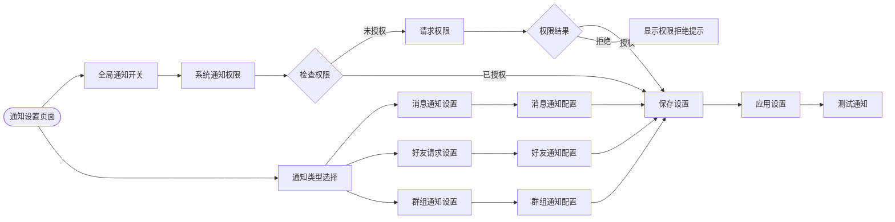
```mermaid
flowchart LR
    Settings([通知设置页面]) --> GlobalToggle[全局通知开关]
    Settings --> TypeSelect[通知类型选择]

    GlobalToggle --> SystemNotify[系统通知权限]
    TypeSelect --> MessageNotify[消息通知设置]
    TypeSelect --> FriendNotify[好友请求设置]
    TypeSelect --> GroupNotify[群组通知设置]

    SystemNotify --> PermissionCheck{检查权限}
    PermissionCheck -->|未授权| RequestPermission[请求权限]
    PermissionCheck -->|已授权| SaveSettings[保存设置]

    MessageNotify --> MessageConfig[消息通知配置]
    FriendNotify --> FriendConfig[好友通知配置]
    GroupNotify --> GroupConfig[群组通知配置]

    MessageConfig --> SaveSettings
    FriendConfig --> SaveSettings
    GroupConfig --> SaveSettings

    RequestPermission --> PermissionResult{权限结果}
    PermissionResult -->|授权| SaveSettings
    PermissionResult -->|拒绝| ShowDenied[显示权限拒绝提示]

    SaveSettings --> ApplySettings[应用设置]
    ApplySettings --> TestNotify[测试通知]
```

## 7. 数据同步流程

### 7.1 实时数据同步

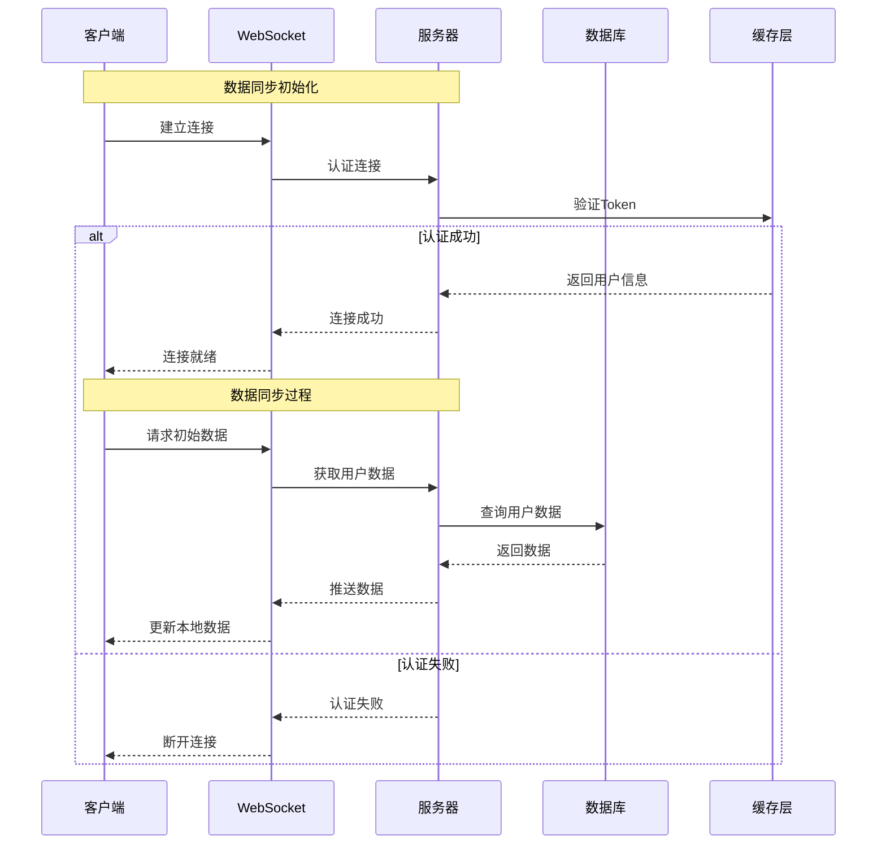
```mermaid
sequenceDiagram
    participant Client as 客户端
    participant WS as WebSocket
    participant Server as 服务器
    participant DB as 数据库
    participant Cache as 缓存层

    Note over Client,Server: 数据同步初始化
    Client->>WS: 建立连接
    WS->>Server: 认证连接
    Server->>Cache: 验证Token

    alt 认证成功
        Cache-->>Server: 返回用户信息
        Server-->>WS: 连接成功
        WS-->>Client: 连接就绪

        Note over Client,Server: 数据同步过程
        Client->>WS: 请求初始数据
        WS->>Server: 获取用户数据
        Server->>DB: 查询用户数据
        DB-->>Server: 返回数据
        Server-->>WS: 推送数据
        WS-->>Client: 更新本地数据
    else 认证失败
        Server-->>WS: 认证失败
        WS-->>Client: 断开连接
    end
```

### 7.2 离线数据同步

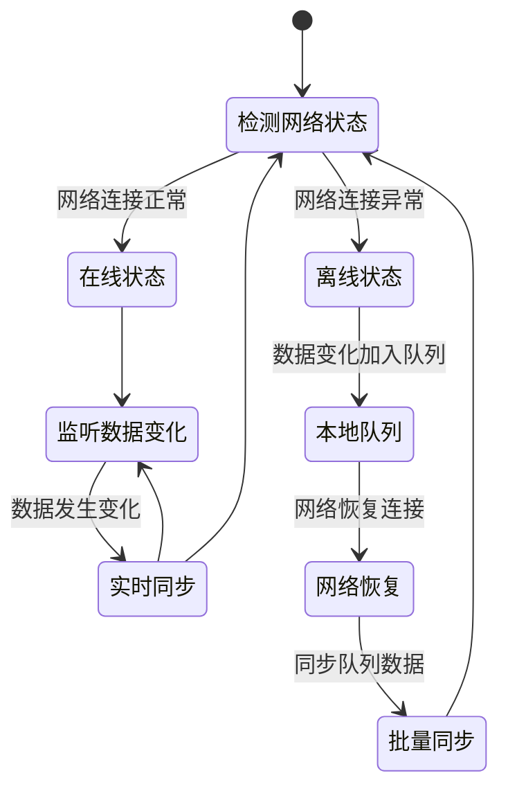
```mermaid
stateDiagram-v2
    [*] --> 检测网络状态
    检测网络状态 --> 在线状态: 网络连接正常
    检测网络状态 --> 离线状态: 网络连接异常

    在线状态 --> 监听数据变化
    监听数据变化 --> 实时同步: 数据发生变化
    实时同步 --> 监听数据变化
    实时同步 --> 检测网络状态

    离线状态 --> 本地队列: 数据变化加入队列
    本地队列 --> 网络恢复: 网络恢复连接
    网络恢复 --> 批量同步: 同步队列数据
    批量同步 --> 检测网络状态
```

## 8. 性能优化流程

### 8.1 虚拟滚动流程

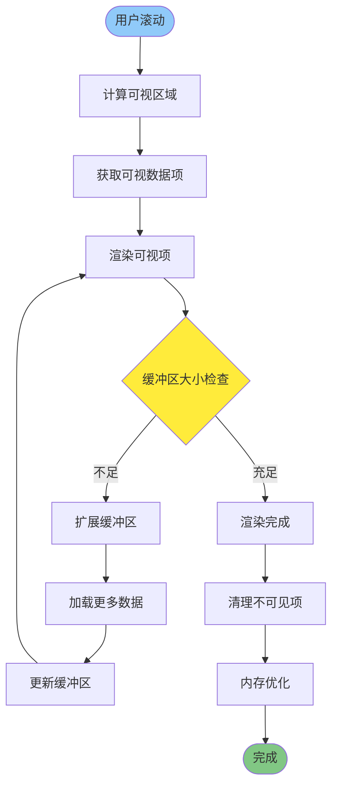
```mermaid
flowchart TD
    Scroll([用户滚动]) --> CalcVisible[计算可视区域]
    CalcVisible --> GetVisibleItems[获取可视数据项]
    GetVisibleItems --> RenderItems[渲染可视项]

    RenderItems --> BufferSize{缓冲区大小检查}
    BufferSize -->|不足| ExtendBuffer[扩展缓冲区]
    BufferSize -->|充足| RenderComplete[渲染完成]

    ExtendBuffer --> LoadMoreData[加载更多数据]
    LoadMoreData --> UpdateBuffer[更新缓冲区]
    UpdateBuffer --> RenderItems

    RenderComplete --> Cleanup[清理不可见项]
    Cleanup --> MemoryOptimize[内存优化]
    MemoryOptimize --> End([完成])

    style Scroll fill:#90caf9
    style End fill:#81c784
    style BufferSize fill:#ffeb3b
```

### 8.2 图片懒加载流程

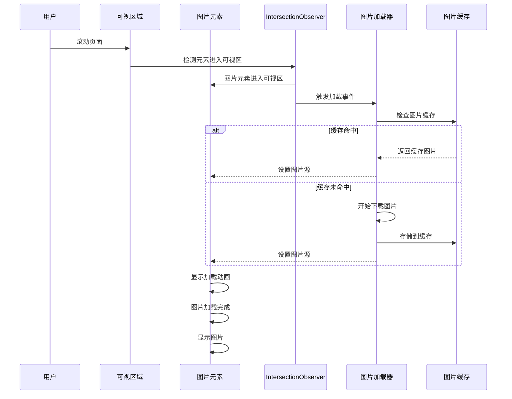
```mermaid
sequenceDiagram
    participant User as 用户
    participant Viewport as 可视区域
    participant Image as 图片元素
    participant Observer as IntersectionObserver
    participant Loader as 图片加载器
    participant Cache as 图片缓存

    User->>Viewport: 滚动页面
    Viewport->>Observer: 检测元素进入可视区
    Observer->>Image: 图片元素进入可视区

    Observer->>Loader: 触发加载事件
    Loader->>Cache: 检查图片缓存

    alt 缓存命中
        Cache-->>Loader: 返回缓存图片
        Loader-->>Image: 设置图片源
    else 缓存未命中
        Loader->>Loader: 开始下载图片
        Loader->>Cache: 存储到缓存
        Loader-->>Image: 设置图片源
    end

    Image->>Image: 显示加载动画
    Image->>Image: 图片加载完成
    Image->>Image: 显示图片
```

## 9. 错误处理流程

### 9.1 网络错误处理

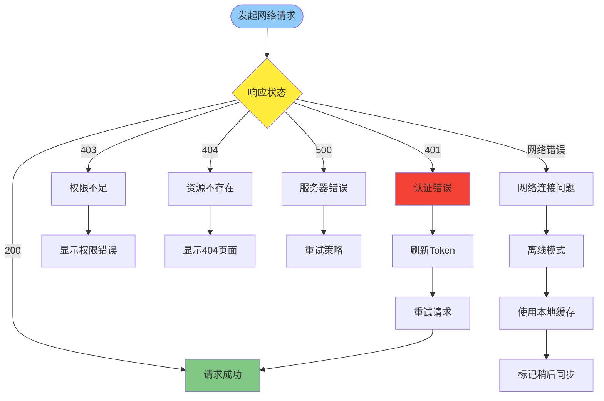
```mermaid
flowchart TD
    NetworkRequest([发起网络请求]) --> Response{响应状态}

    Response -->|200| Success[请求成功]
    Response -->|401| AuthError[认证错误]
    Response -->|403| Forbidden[权限不足]
    Response -->|404| NotFound[资源不存在]
    Response -->|500| ServerError[服务器错误]
    Response -->|网络错误| NetworkIssue[网络连接问题]

    AuthError --> RefreshToken[刷新Token]
    Forbidden --> ShowPermission[显示权限错误]
    NotFound --> Show404[显示404页面]
    ServerError --> RetryStrategy[重试策略]
    NetworkIssue --> OfflineMode[离线模式]

    RefreshToken --> RetryRequest[重试请求]
    RetryRequest --> Success

    OfflineMode --> LocalCache[使用本地缓存]
    LocalCache --> SyncLater[标记稍后同步]

    style NetworkRequest fill:#90caf9
    style Success fill:#81c784
    style Response fill:#ffeb3b
    style AuthError fill:#f44336
```

### 9.2 应用异常恢复流程

```mermaid
stateDiagram-v2
    [*] --> 监控应用状态
    监控应用状态 --> 正常运行: 状态正常
    监控应用状态 --> 检测异常: 发现异常

    检测异常 --> 记录错误日志
    记录错误日志 --> 判断异常类型
    判断异常类型 --> 内存泄漏: 内存相关
    判断异常类型 --> 渲染异常: 渲染相关
    判断异常类型 --> 数据异常: 数据相关

    内存泄漏 --> 清理内存
    渲染异常 --> 重置组件
    数据异常 --> 回滚数据

    清理内存 --> 恢复功能
    重置组件 --> 恢复功能
    回滚数据 --> 恢复功能

    恢复功能 --> 正常运行
```

## 10. 总结

本功能架构设计流程图涵盖了 HuLa 即时通讯系统的核心功能流程，包括：

1. **用户认证**: 完整的登录、Token管理和二维码登录
2. **聊天功能**: 消息发送接收、撤回、群聊处理
3. **文件管理**: 上传下载、共享、缓存管理
4. **联系人**: 好友添加、群组管理
5. **AI集成**: 多模态AI对话和内容生成
6. **设置配置**: 主题切换、通知管理
7. **数据同步**: 实时同步、离线队列
8. **性能优化**: 虚拟滚动、懒加载机制
9. **错误处理**: 网络异常、应用恢复

这些流程图确保了系统的可靠性和用户体验，为开发团队提供了清晰的功能实现指导。