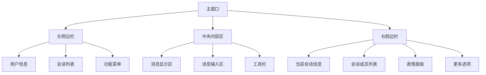
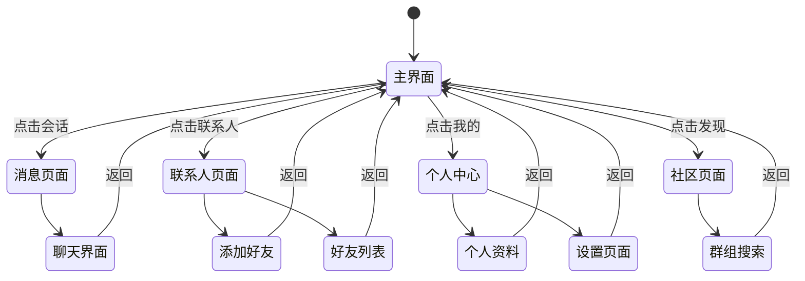
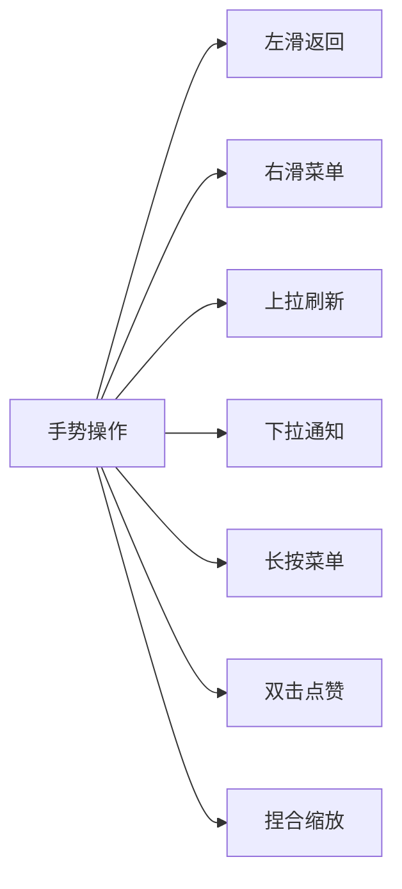

# HuLa 交互文档与用户指南

## 目录

1. [快速开始](#1-快速开始)
2. [用户界面指南](#2-用户界面指南)
3. [桌面端使用](#3-桌面端使用)
4. [移动端使用](#4-移动端使用)
5. [功能详细说明](#5-功能详细说明)
6. [高级功能](#6-高级功能)
7. [故障排除](#7-故障排除)
8. [最佳实践](#8-最佳实践)

## 1. 快速开始

### 1.1 系统要求

**桌面端**:
- Windows 10+ / macOS 10.15+ / Linux (Ubuntu 18.04+)
- 内存: 最低 2GB，推荐 4GB+
- 存储: 至少 500MB 可用空间
- 网络: 稳定的互联网连接

**移动端**:
- iOS 12.0+ / Android 6.0+
- 内存: 最低 1GB
- 存储: 至少 200MB 可用空间
- 网络: 稳定的互联网连接

### 1.2 安装步骤

#### 桌面端安装

1. **下载应用**
   ```bash
   # Windows
   下载 HuLa-Setup-x.x.x.exe

   # macOS
   下载 HuLa-x.x.x.dmg

   # Linux
   下载 HuLa-x.x.x.AppImage
   ```

2. **安装应用**
   - Windows: 双击 `.exe` 文件，按照安装向导完成安装
   - macOS: 打开 `.dmg` 文件，将应用拖拽到 Applications 文件夹
   - Linux: 给 `.AppImage` 文件添加执行权限并运行

3. **首次启动**
   - 启动应用后，会显示登录界面
   - 创建新账户或使用现有账户登录

#### 移动端安装

1. **应用商店下载**
   - iOS: App Store 搜索 "HuLa"
   - Android: Google Play Store 搜索 "HuLa"

2. **手动安装**
   ```bash
   # iOS
   下载 .ipa 文件，通过 iTunes 或其他工具安装

   # Android
   下载 .apk 文件，允许未知来源应用安装
   ```

### 1.3 首次使用

#### 创建账户

1. 点击"注册新账户"
2. 填写必要信息：
   - 邮箱地址
   - 用户名
   - 密码
   - 确认密码
   - 验证码
3. 完成邮箱验证
4. 设置个人资料（头像、昵称等）

#### 登录账户

1. 输入用户名/邮箱和密码
2. 选择记住登录状态（可选）
3. 点击"登录"按钮
4. 二维码登录（移动端特有功能）：
   - 点击二维码图标
   - 使用其他设备扫描二维码
   - 确认登录

## 2. 用户界面指南

### 2.1 桌面端界面布局



#### 左侧边栏功能

- **用户信息区域**: 显示当前登录用户信息、头像、在线状态
- **会话列表**: 显示所有聊天会话，支持搜索和筛选
- **功能菜单**: 包含设置、文件管理、AI助手等功能入口

#### 中央内容区

- **消息显示区**: 显示聊天消息，支持文本、图片、文件、语音等
- **消息输入区**: 文本输入框，支持表情、文件、截图等功能
- **工具栏**: 包含格式化工具、引用回复、@提醒等功能

#### 右侧边栏功能

- **会话信息**: 显示当前会话的详细信息
- **成员列表**: 群聊时显示所有成员
- **表情面板**: 快速选择表情和贴图
- **更多选项**: 邀请、设置、搜索等功能

### 2.2 移动端界面布局



#### 移动端导航结构

- **底部导航栏**: 消息、联系人、我的、发现四个主要入口
- **顶部栏**: 搜索、通知、更多选项
- **手势操作**: 左滑返回、右滑菜单、下拉刷新等

## 3. 桌面端使用

### 3.1 基础聊天操作

#### 发送消息

1. **文本消息**
   ```typescript
   // 在输入框中输入文本
   // 按回车键或点击发送按钮
   ```

2. **富文本消息**
   - 选择文字样式：加粗、斜体、下划线、删除线
   - 插入表情：点击表情按钮或使用快捷键
   - 插入图片：拖拽图片到输入框或点击上传按钮
   - 插入文件：点击文件按钮选择本地文件
   - 插入@提醒：输入@符号选择用户

3. **快捷键**
   ```
   Ctrl + Enter     // 发送消息
   Ctrl + Shift + Enter  // 换行输入
   Ctrl + B         // 加粗文字
   Ctrl + I         // 斜体文字
   Ctrl + U         // 下划线
   Ctrl + S         // 删除线
   Tab             // 完成@用户提及
   ```

#### 消息交互

1. **回复消息**
   - 右键点击消息 → 选择"回复"
   - 消息上方出现回复输入框
   - 输入回复内容并发送

2. **引用消息**
   - 拖拽消息到输入框
   - 或点击消息后的引用按钮
   - 消息会以引用形式显示

3. **消息操作**
   ```
   右键菜单选项：
   - 复制文本
   - 复制消息
   - 转发消息
   - 删除消息
   - 撤回消息
   - 添加表情反应
   - @用户
   ```

### 3.2 文件操作

#### 文件上传

1. **单文件上传**
   ```bash
   # 方法1: 拖拽
   将文件拖拽到聊天窗口

   # 方法2: 点击上传
   点击文件上传按钮 → 选择文件 → 确认上传

   # 方法3: 快捷键
   Ctrl + O (Windows/Linux)
   Cmd + O (macOS)
   ```

2. **批量文件上传**
   - 选择多个文件：Ctrl/Cmd + 点击多选
   - 文件夹上传：直接拖拽整个文件夹
   - 上传队列显示在输入框上方

3. **大文件处理**
   - 自动分片上传
   - 显示上传进度条
   - 支持断点续传
   - 上传完成后自动生成预览

#### 文件下载

1. **图片下载**
   - 点击图片查看大图
   - 右键选择"另存为"
   - 双击图片快速下载

2. **文件下载**
   - 点击文件消息中的下载按钮
   - 查看下载进度
   - 下载完成后点击打开文件

3. **下载管理**
   - 访问"文件管理"窗口
   - 查看所有下载历史
   - 管理下载文件和进度

### 3.3 系统托盘

#### 托盘功能

1. **基础操作**
   ```bash
   # 左键点击：显示/隐藏主窗口
   # 右键点击：显示托盘菜单

   托盘菜单选项：
   - 显示主窗口
   - 新建消息
   - 截图
   - 设置
   - 关于
   - 退出
   ```

2. **通知功能**
   - 新消息通知：显示发送者头像和消息预览
   - 未读计数：在托盘图标上显示未读数量
   - 点击通知：直接跳转到对应会话

#### 截图功能

```bash
# 快捷键截图
Windows: PrtScn / Ctrl + PrtScn
macOS: Cmd + Shift + 4
Linux: PrtScn / Shift + PrtScn

# 应用内截图
Ctrl + Alt + A  # 区域截图
Ctrl + Alt + W  # 窗口截图
Ctrl + Alt + F  # 全屏截图
```

### 3.4 多窗口管理

#### 窗口类型

1. **主窗口**: 聊天界面
2. **登录窗口**: 用户认证界面
3. **设置窗口**: 应用设置界面
4. **文件管理窗口**: 文件浏览和管理
5. **图片查看器**: 图片预览和编辑
6. **视频查看器**: 视频播放
7. **通知窗口**: 系统通知弹窗

#### 窗口操作

```typescript
// 窗口快捷键
Alt + Tab        // 在窗口间切换
Alt + F4         // 关闭当前窗口
Windows键 + Tab  // 在应用间切换
```

## 4. 移动端使用

### 4.1 基础操作

#### 手势导航



#### 具体手势

1. **左滑返回**: 从屏幕左边缘向右滑动返回上一级
2. **下拉通知**: 从屏幕顶部向下滑动显示通知中心
3. **上拉刷新**: 在列表页面向下滑动刷新内容
4. **长按操作**: 长按消息显示操作菜单
5. **双击操作**: 双击消息快速点赞
6. **捏合缩放**: 双指捏合缩放图片和视频

### 4.2 移动端特有功能

#### 扫码功能

1. **扫码加好友**
   - 点击"扫一扫"
   - 对准好友二维码
   - 自动识别并发送好友请求

2. **扫码入群**
   - 点击"扫码加群"
   - 对准群二维码
   - 自动申请加入群组

3. **我的二维码**
   - 点击"我的二维码"
   - 显示个人二维码
   - 其他人可扫码添加好友

#### 键盘适配

1. **输入框键盘适配**
   ```css
   /* 输入时自动调整页面布局 */
   .chat-input-focused {
     padding-bottom: var(--keyboard-height);
   }
   ```

2. **表情选择器优化**
   - 表情面板自动适配键盘高度
   - 支持快速搜索表情
   - 最近使用的表情置顶

3. **语音输入优化**
   - 长按录音按钮
   - 录音波形实时显示
   - 录音转文字可选功能

### 4.3 通知管理

#### 推送通知

1. **消息通知**
   - 显示发送者头像和昵称
   - 显示消息内容预览
   - 支持图片和文件预览
   - 点击通知直接进入会话

2. **好友请求通知**
   - 显示好友请求详情
   - 提供"同意"和"拒绝"按钮
   - 批量处理多个请求

3. **群组通知**
   - 群邀请通知
   - @提醒通知
   - 群公告通知

#### 通知设置

```typescript
// 通知权限设置
interface NotificationSettings {
  message: boolean      // 消息通知
  friendRequest: boolean // 好友请求通知
  groupInvite: boolean  // 群组邀请通知
  mention: boolean      // @提醒通知
  sound: boolean        // 声音提醒
  vibration: boolean   // 震动提醒
  quietHours: {        // 免打扰时段
    start: string      // 开始时间
    end: string        // 结束时间
  }
}
```

## 5. 功能详细说明

### 5.1 AI助手功能

#### 对话模式

1. **多模型支持**
   ```typescript
   interface AIModel {
     name: string        // 模型名称
     type: 'OpenAI' | 'Ollama'  // 模型类型
     capability: string[] // 支持的能力
   }
   ```

2. **对话上下文**
   - 自动保存对话历史
   - 支持长上下文记忆
   - 可设置上下文窗口大小
   - 支持多轮对话连贯性

3. **流式响应**
   - 实时显示AI回复内容
   - 支持中断生成
   - 显示生成进度和思考过程

#### 生成功能

1. **文本生成**
   ```typescript
   interface TextGeneration {
     prompt: string      // 输入提示词
     maxTokens: number  // 最大生成长度
     temperature: number // 创意性参数
   }
   ```

2. **图像生成**
   ```typescript
   interface ImageGeneration {
     description: string  // 图像描述
     style: string       // 图像风格
     size: string        // 图像尺寸
     quality: string     // 图像质量
   }
   ```

3. **视频生成**
   ```typescript
   interface VideoGeneration {
     script: string      // 视频脚本
     duration: number    // 视频时长
     resolution: string  // 分辨率
   }
   ```

### 5.2 群组功能

#### 群组类型

1. **普通群**: 最多500人，支持基础功能
2. **大群**: 最多2000人，支持高级管理功能
3. **企业群**: 支持部门架构，权限分级管理

#### 权限管理

```typescript
enum GroupRole {
  OWNER = 1,      // 群主
  ADMIN = 2,       // 管理员
  MEMBER = 3,      // 普通成员
  MUTED = 4        // 禁言成员
  BANNED = 5       // 踢出成员
}

interface GroupPermissions {
  sendMessage: boolean   // 发送消息权限
  sendFile: boolean     // 发送文件权限
  inviteMember: boolean // 邀请成员权限
  kickMember: boolean   // 踢出成员权限
  setAnnouncement: boolean // 设置公告权限
  manageSettings: boolean  // 管理设置权限
}
```

### 5.3 文件管理

#### 文件类型支持

1. **文档类型**
   - Office文档：.docx, .xlsx, .pptx
   - PDF文档：.pdf
   - 文本文档：.txt, .md
   - 其他文档：支持预览和下载

2. **媒体类型**
   - 图片：.jpg, .png, .gif, .webp
   - 视频：.mp4, .avi, .mov
   - 音频：.mp3, .wav, .m4a

3. **压缩文件**
   - .zip, .rar, .7z
   - 支持在线预览压缩包内容

#### 存储策略

```typescript
interface StorageConfig {
  maxFileSize: number        // 单文件最大大小(MB)
  dailyLimit: number        // 日上传限制(MB)
  monthlyLimit: number      // 月上传限制(MB)
  compression: boolean       // 是否自动压缩
  encryption: boolean        // 是否加密存储
  retention: number         // 保留时间(天)
}
```

## 6. 高级功能

### 6.1 插件系统

#### 插件类型

1. **UI插件**: 自定义界面主题和布局
2. **功能插件**: 扩展应用功能
3. **集成插件**: 第三方服务集成

#### 插件开发

```typescript
// 插件接口定义
interface HuLaPlugin {
  name: string           // 插件名称
  version: string        // 插件版本
  description: string     // 插件描述

  // 插件生命周期
  install(): Promise<void>
  activate(): Promise<void>
  deactivate(): Promise<void>
  uninstall(): Promise<void>

  // 功能接口
  onMessage?(message: MessageItem): void
  onUserOnline?(userId: string): void
  onFileUpload?(file: FileItem): void
}
```

### 6.2 主题定制

#### 主题配置

```css
/* 自定义主题变量 */
:root {
  --primary-color: #007bff;
  --secondary-color: #6c757d;
  --background-color: #ffffff;
  --text-color: #212529;
  --border-color: #dee2e6;
  --shadow-color: rgba(0,0,0,0.1);
}

/* 暗色主题 */
[data-theme="dark"] {
  --primary-color: #0d6efd;
  --secondary-color: #495057;
  --background-color: #1a1a1a;
  --text-color: #e9ecef;
  --border-color: #343a40;
  --shadow-color: rgba(0,0,0,0.3);
}
```

#### 主题导入导出

```bash
# 导出主题
点击 设置 → 主题 → 导出当前主题

# 导入主题
点击 设置 → 主题 → 导入主题文件(.hula-theme)
```

### 6.3 数据同步

#### 同步设置

```typescript
interface SyncSettings {
  autoSync: boolean       // 自动同步
  syncInterval: number     // 同步间隔(分钟)
  syncWifiOnly: boolean  // 仅WiFi同步
  compressData: boolean   // 压缩同步数据
  encryption: boolean      // 加密传输
}
```

#### 多设备同步

1. **云端同步**
   - 消息历史同步
   - 联系人信息同步
   - 设置和配置同步
   - 文件云端存储

2. **本地同步**
   - 局域网络同步
   - 热点功能
   - 离线模式支持

## 7. 故障排除

### 7.1 常见问题

#### 连接问题

1. **无法连接服务器**
   ```
   检查清单：
   ✓ 网络连接是否正常
   ✓ 防火墙是否阻止连接
   ✓ 服务器地址是否正确
   ✓ DNS解析是否正常

   解决方案：
   1. 检查网络设置
   2. 重置网络配置
   3. 更换网络环境
   4. 联系技术支持
   ```

2. **消息发送失败**
   ```
   可能原因：
   - 网络连接不稳定
   - 消息内容包含敏感词
   - 文件大小超限
   - 对方已离线

   解决方案：
   1. 检查网络状态
   2. 检查消息内容
   3. 重新登录
   4. 重启应用
   ```

#### 性能问题

1. **应用卡顿**
   ```
   优化建议：
   - 清理缓存数据
   - 关闭不必要的插件
   - 降低消息历史加载数量
   - 启用硬件加速
   - 更新到最新版本
   ```

2. **内存占用过高**
   ```
   解决方案：
   - 调整虚拟滚动设置
   - 减少同时打开的会话数
   - 清理媒体文件缓存
   - 重启应用释放内存
   ```

### 7.2 日志和调试

#### 启用调试模式

```bash
# 桌面端调试
设置 → 高级 → 启用调试模式

# 移动端调试
连续点击版本号5次 → 启用调试菜单
```

#### 日志收集

```typescript
// 日志级别
enum LogLevel {
  ERROR = 0,    // 错误信息
  WARN = 1,     // 警告信息
  INFO = 2,     // 一般信息
  DEBUG = 3,    // 调试信息
  VERBOSE = 4   // 详细信息
}

// 获取日志文件
const logFiles = await invoke('get_log_files')
// 导出诊断报告
const diagnostic = await invoke('export_diagnostic_report')
```

### 7.3 数据备份与恢复

#### 数据备份

```bash
# 自动备份
设置 → 数据与隐私 → 自动备份 → 启用
设置备份间隔：每天/每周/每月

# 手动备份
设置 → 数据与隐私 → 立即备份 → 选择备份位置
```

#### 数据恢复

```bash
# 恢复步骤
1. 安装新版本HuLa
2. 跳过登录步骤
3. 点击"从备份恢复"
4. 选择备份文件
5. 确认恢复数据
6. 重启应用
```

## 8. 最佳实践

### 8.1 使用建议

#### 账户安全

1. **密码安全**
   ```
   密码要求：
   - 至少8位字符
   - 包含大小写字母
   - 包含数字
   - 包含特殊字符
   - 定期更换密码
   - 不使用简单密码
   ```

2. **账户安全**
   ```
   安全措施：
   - 启用两步验证
   - 定期检查登录设备
   - 设置登录提醒
   - 及时退出不常用设备
   - 备份重要数据
   ```

#### 隐私保护

1. **信息分享控制**
   - 谨慎分享个人信息
   - 使用昵称而非真实姓名
   - 控制位置信息分享
   - 定期检查隐私设置

2. **数据管理**
   ```
   隐私建议：
   - 定期清理聊天记录
   - 删除敏感文件
   - 使用阅后即焚
   - 检查第三方授权
   ```

### 8.2 效率优化

#### 操作效率

1. **快捷键使用**
   ```bash
   常用快捷键：
   Ctrl + N        // 新建会话
   Ctrl + F        // 搜索会话
   Ctrl + 1-9      // 快速切换会话
   Ctrl + Tab       // 切换窗口
   Ctrl + Enter     // 发送消息
   ```

2. **批量操作**
   ```
   批量功能：
   - 批量文件上传
   - 批量消息选择
   - 批量好友操作
   - 批量群管理
   ```

#### 信息管理

1. **消息组织**
   - 使用标签分类会话
   - 设置重要会话置顶
   - 定期归档历史会话
   - 使用搜索功能快速查找

2. **文件管理**
   - 建立文件分类体系
   - 定期清理无用文件
   - 使用云存储备份重要文件
   - 设置文件访问权限

### 8.3 团队协作

#### 群组管理

1. **群组结构**
   ```
   群组组织：
   - 设置明确的群组规则
   - 使用群公告功能
   - 设置成员权限分级
   - 定期清理不活跃成员
   ```

2. **沟通规范**
   ```
   协作建议：
   - 使用@功能提醒相关人员
   - 及时回复重要消息
   - 合理使用表情和贴图
   - 避免发送垃圾信息
   ```

---

## 联系与支持

### 官方支持
- **官方网站**: https://hula.example.com
- **帮助文档**: https://docs.hula.example.com
- **技术支持**: support@hula.example.com
- **社区论坛**: https://forum.hula.example.com

### 反馈渠道
- **应用内反馈**: 设置 → 帮助与反馈
- **GitHub Issues**: https://github.com/HuLaSpark/HuLa/issues
- **用户交流群**: 扫描官方二维码加入

### 更新说明
- **自动更新**: 应用会自动检查并下载更新
- **更新日志**: 查看每次更新的详细说明
- **回退版本**: 如遇到问题可回退到稳定版本

---

*本文档持续更新中，最新版本请访问官方网站。*