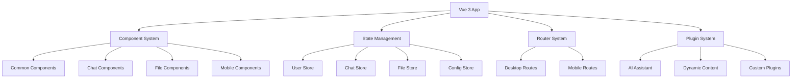
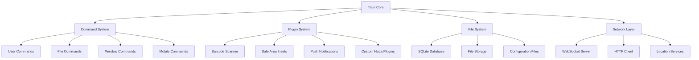

# HuLa Interactive Knowledge Base

## 🚀 Quick Start Guide

### What is HuLa?
HuLa is a **cross-platform instant messaging system** built with modern web technologies that provides seamless communication across desktop and mobile devices. It combines the power of Tauri for native performance with Vue 3 for responsive user interfaces.

### Key Features
- **📱 Multi-Platform**: Windows, macOS, Linux, iOS, Android
- **💬 Real-time Chat**: Private messages, group chats, file sharing
- **🤖 AI Integration**: Built-in AI assistant for intelligent conversations
- **📁 File Management**: Secure file transfer with cloud storage
- **🎨 Customizable**: Multiple themes, emoji packs, and layouts
- **🔐 Secure**: End-to-end encryption with modern authentication

## 🏗️ System Architecture

### Frontend Layer


### Backend Layer (Tauri)


## 🔧 Development Environment

### Prerequisites
```bash
# Required versions
Node.js >= 20.19.0
pnpm >= 10.x
Rust >= 1.70.0 (for Tauri development)

# Platform requirements
- Windows: Windows 10/11 with WebView2
- macOS: macOS 10.5+ with Xcode Command Line Tools
- Linux: Ubuntu 20.04+ or equivalent
- iOS: iOS 12.0+ with Xcode 14+
- Android: Android 5.0+ (API 21+) with Android Studio
```

### Quick Setup
```bash
# Clone the repository
git clone https://gitee.com/HuLaSpark/HuLa.git
cd HuLa

# Install dependencies
pnpm install

# Start development
# Desktop development
pnpm run tauri:dev    # or: pnpm run td

# Mobile development (requires additional setup)
pnpm run tauri:ios:dev     # iOS development
pnpm run tauri:android:dev  # Android development
```

## 📚 Component Library

### Core Components

#### Chat System
| Component | Purpose | Props | Usage Example |
|-----------|---------|------|--------------|
| `Chat.vue` | Main chat interface | `messages: Message[]`, `user: User`, `onSend: Function` | `<Chat :messages="chatMessages" :user="currentUser" @send="handleSend" />` |
| `MessageText.vue` | Text message rendering | `message: Message`, `isOwn: boolean` | `<MessageText :message="msg" :is-own="msg.isOwn" />` |
| `MessageImage.vue` | Image message with zoom | `message: Message`, `preview: boolean` | `<MessageImage :message="msg" preview @zoom="handleZoom" />` |
| `MessageFile.vue` | File attachment display | `message: Message`, `downloadable: boolean` | `<MessageFile :message="msg" downloadable @download="handleDownload" />` |

#### File Management
| Component | Purpose | Props | Features |
|-----------|---------|------|----------|
| `FileManager.vue` | File browser and uploader | `path: string`, `allowUpload: boolean` | Drag & drop, file type filtering, batch operations |
| `FileUploadProgress.vue` | Upload progress tracking | `file: File`, `progress: number` | Cancelable uploads, resume support, speed indicators |
| `FileContent.vue` | File preview and viewer | `file: FileItem`, `readonly: boolean` | Multi-format support, zoom controls, fullscreen mode |

#### Mobile Components
| Component | Platform | Purpose |
|-----------|---------|--------|
| `MobileLayout.vue` | iOS/Android | Main mobile layout container |
| `ChatRoomLayout.vue` | iOS/Android | Chat interface optimized for touch |
| `PullToRefresh.vue` | iOS/Android | Pull-to-refresh functionality |
| `VirtualList.vue` | Cross-platform | Optimized list rendering for large datasets |

### Custom Components Development

#### Creating Reusable Components
```vue
<template>
  <div class="custom-component" :class="{ 'is-active': isActive }">
    <slot name="header" v-if="$slots.header" />
    <div class="content">
      <slot />
    </div>
    <slot name="footer" v-if="$slots.footer" />
  </div>
</template>

<script setup lang="ts">
interface Props {
  isActive?: boolean
  variant?: 'primary' | 'secondary' | 'danger'
}

withDefaults(defineProps<Props>(), {
  isActive: false,
  variant: 'primary'
})

interface Emits {
  (e: 'click', value: MouseEvent): void
  (e: 'change', value: any): void
}

const emit = defineEmits<Emits>()
</script>

<style scoped>
.custom-component {
  /* Component-specific styling */
}

.is-active {
  /* Active state styling */
}
</style>
```

## 🔄 State Management (Pinia)

### Store Structure

#### User Store (`stores/user.ts`)
```typescript
export const useUserStore = defineStore('user', () => {
  // State
  const user = ref<User | null>(null)
  const isAuthenticated = ref(false)
  const devices = ref<DeviceInfo[]>([])
  const preferences = ref<UserPreferences>(defaultPreferences)

  // Actions
  const login = async (credentials: LoginCredentials) => {
    try {
      const result = await authService.login(credentials)
      user.value = result.userInfo
      isAuthenticated.value = true
      await saveAuthToken(result.token)
    } catch (error) {
      throw new AuthenticationError(error.message)
    }
  }

  const logout = async () => {
    await authService.logout()
    user.value = null
    isAuthenticated.value = false
    clearAuthToken()
  }

  const updateProfile = async (updates: Partial<User>) => {
    if (user.value) {
      user.value = { ...user.value, ...updates }
      await userService.updateProfile(user.value.id, updates)
    }
  }

  return {
    // State
    user: readonly(user),
    isAuthenticated: readonly(isAuthenticated),
    devices: readonly(devices),
    preferences: readonly(preferences),

    // Actions
    login,
    logout,
    updateProfile,
    addDevice: (device: DeviceInfo) => devices.value.push(device),
    removeDevice: (deviceId: string) => {
      devices.value = devices.value.filter(d => d.id !== deviceId)
    }
  }
})
```

#### Chat Store (`stores/ws.ts`)
```typescript
export const useWebSocketStore = defineStore('websocket', () => {
  // State
  const isConnected = ref(false)
  const messages = ref<Message[]>([])
  const activeChat = ref<string | null>(null)
  const typingUsers = ref<Set<string>>(new Set())
  const connectionStatus = ref<'connecting' | 'connected' | 'disconnected' | 'error'>('disconnected')

  // Actions
  const connect = async (url: string) => {
    connectionStatus.value = 'connecting'
    try {
      await webSocketAdapter.connect(url)
      isConnected.value = true
      connectionStatus.value = 'connected'
    } catch (error) {
      connectionStatus.value = 'error'
      throw error
    }
  }

  const sendMessage = async (message: Omit<Message, 'id' | 'timestamp'>) => {
    const fullMessage: Message = {
      ...message,
      id: generateMessageId(),
      timestamp: Date.now()
    }

    messages.value.push(fullMessage)
    await webSocketAdapter.send(fullMessage)
  }

  const markAsRead = (messageId: string) => {
    const message = messages.value.find(m => m.id === messageId)
    if (message && !message.isRead) {
      message.isRead = true
      webSocketAdapter.send({
        type: 'read_receipt',
        messageId
      })
    }
  }

  return {
    // State
    isConnected: readonly(isConnected),
    messages: readonly(messages),
    activeChat: readonly(activeChat),
    typingUsers: readonly(typingUsers),
    connectionStatus: readonly(connectionStatus),

    // Actions
    connect,
    disconnect: () => webSocketAdapter.disconnect(),
    sendMessage,
    markAsRead,
    setActiveChat: (chatId: string) => activeChat.value = chatId,
    addTypingUser: (userId: string) => typingUsers.value.add(userId),
    removeTypingUser: (userId: string) => typingUsers.value.delete(userId)
  }
})
```

## 🔌 Plugin Development

### Creating Custom Plugins

#### Plugin Structure
```
src-tauri/
├── src/
│   ├── plugins/
│   │   └── my-plugin/
│   │       ├── init.rs     # Plugin initialization
│   │       ├── commands.rs  # Tauri commands
│   │       └── config.rs   # Plugin configuration
│   └── lib.rs          # Plugin registration
└── Cargo.toml
```

#### Example Plugin Command
```rust
// src-tauri/src/plugins/my-plugin/commands.rs
use tauri::{command, State};
use crate::MyPluginState;

#[command]
pub async fn my_command(
    state: State<'_, MyPluginState>,
    input: String,
) -> Result<String, String> {
    // Plugin logic here
    Ok(format!("Processed: {}", input))
}

#[command]
pub async fn get_plugin_info(
    state: State<'_, MyPluginState>,
) -> Result<PluginInfo, String> {
    Ok(PluginInfo {
        name: "My Plugin".to_string(),
        version: "1.0.0".to_string(),
        description: "A custom HuLa plugin".to_string(),
    })
}
```

#### Frontend Plugin Integration
```typescript
// src/plugins/my-plugin/index.ts
import { invoke } from '@tauri-apps/api/tauri'

export interface MyPluginAPI {
  process(input: string): Promise<string>
  getInfo(): Promise<PluginInfo>
}

export const myPluginAPI: MyPluginAPI = {
  async process(input: string) {
    return await invoke('plugin:my_command', { input })
  },

  async getInfo() {
    return await invoke('plugin:get_plugin_info')
  }
}
```

## 📱 Mobile Development

### Platform-Specific Considerations

#### iOS Development
```typescript
// iOS-specific optimizations
import { getSafeAreaInsets } from '@tauri-apps/plugin-safe-area-insets'

// Handle safe area insets
const insets = await getSafeAreaInsets()
applySafeAreaStyles(insets)

// iOS-specific gestures
import { useGestures } from '@/composables/useGestures'

const { onSwipe, onPinch } = useGestures()

onSwipe('left', () => {
  // Handle left swipe
})

onPinch('zoom', (scale: number) => {
  // Handle pinch zoom
})
```

#### Android Development
```typescript
// Android-specific optimizations
import { requestPermission } from '@tauri-apps/plugin-android-permissions'

// Request Android permissions
const hasPermission = await requestPermission('camera')

// Android-specific file handling
import { useAndroidFilePicker } from '@/composables/useAndroidFilePicker'

const { pickFile, pickMultipleFiles } = useAndroidFilePicker()

const file = await pickFile({
  type: 'image/*',
  maxSize: 10 * 1024 * 1024 // 10MB
})
```

### Mobile Performance Optimization

#### Virtual Scrolling
```vue
<template>
  <VirtualList
    :items="items"
    :item-size="60"
    :buffer="10"
    v-slot="{ item, index }"
  >
    <MessageItem :message="item" :key="item.id" />
  </VirtualList>
</template>

<script setup lang="ts">
import VirtualList from '@/components/common/VirtualList.vue'

interface Props {
  items: Message[]
}

defineProps<Props>()
</script>
```

#### Touch Optimization
```vue
<template>
  <div class="mobile-chat" @touchstart="handleTouchStart" @touchmove="handleTouchMove">
    <div class="message-container" ref="messageContainer">
      <MessageItem
        v-for="message in visibleMessages"
        :key="message.id"
        :message="message"
        @touchstart="handleMessageTouch"
      />
    </div>
  </div>
</template>

<script setup lang="ts">
const handleTouchStart = (event: TouchEvent) => {
  // Handle touch start with proper timing
  event.preventDefault()
  // Enable smooth scrolling
}

const handleMessageTouch = (message: Message) => {
  // Handle message touch with haptic feedback
  if (navigator.vibrate) {
    navigator.vibrate(10) // Light vibration
  }
  // Show message actions
}
</script>
```

## 🔍 Debugging and Testing

### Debug Tools

#### Tauri DevTools
```bash
# Enable Tauri developer tools
pnpm run tauri:dev --debug

# Rust debugging
RUST_LOG=debug pnpm run tauri:dev

# Frontend debugging
# Vue DevTools are automatically enabled in development
```

#### Mobile Debugging
```bash
# iOS debugging (Safari Web Inspector)
# 1. Enable Web Inspector on iOS device
# 2. Connect via Safari -> Develop menu

# Android debugging (Chrome DevTools)
# 1. Enable USB debugging on Android device
# 2. Connect via chrome://inspect
```

### Testing Strategy

#### Unit Testing
```typescript
// Example component test
import { mount } from '@vue/test-utils'
import { describe, it, expect } from 'vitest'
import ChatMessage from '@/components/rightBox/renderMessage/Text.vue'

describe('ChatMessage', () => {
  it('renders text message correctly', () => {
    const message = {
      id: '1',
      content: 'Hello, world!',
      sender: 'user1',
      timestamp: Date.now()
    }

    const wrapper = mount(ChatMessage, {
      props: { message }
    })

    expect(wrapper.text()).toContain('Hello, world!')
    expect(wrapper.find('.message-sender').text()).toBe('user1')
  })

  it('handles long messages with truncation', () => {
    const longMessage = 'a'.repeat(1000)
    const message = {
      id: '2',
      content: longMessage,
      sender: 'user2',
      timestamp: Date.now()
    }

    const wrapper = mount(ChatMessage, {
      props: { message }
    })

    expect(wrapper.find('.message-content').classes()).toContain('truncated')
  })
})
```

#### Integration Testing
```typescript
// Example WebSocket integration test
import { createPinia } from 'pinia'
import { useWebSocketStore } from '@/stores/ws'

describe('WebSocket Store Integration', () => {
  let store: ReturnType<typeof useWebSocketStore>

  beforeEach(() => {
    const pinia = createPinia()
    store = useWebSocketStore(pinia)
  })

  it('connects and handles messages', async () => {
    await store.connect('ws://localhost:8080')

    expect(store.isConnected).toBe(true)
    expect(store.connectionStatus).toBe('connected')

    const testMessage = {
      type: 'message',
      content: 'Test message',
      sender: 'test-user'
    }

    await store.sendMessage(testMessage)

    expect(store.messages).toContain(expect.objectContaining(testMessage))
  })
})
```

## 📚 Additional Resources

### Official Documentation
- [Vue 3 Documentation](https://vuejs.org/guide/)
- [Tauri Documentation](https://tauri.app/)
- [Vite Documentation](https://vitejs.dev/)
- [Pinia Documentation](https://pinia.vuejs.org/)
- [UnoCSS Documentation](https://uno.antfu.me/)

### Community Resources
- [HuLa GitHub Repository](https://github.com/HuLaSpark/HuLa)
- [HuLa Gitee Repository](https://gitee.com/HuLaSpark/HuLa)
- [Issue Tracker](https://github.com/HuLaSpark/HuLa/issues)
- [Discussion Forum](https://github.com/HuLaSpark/HuLa/discussions)

### Development Tools
- [Vue DevTools](https://devtools.vuejs.org/)
- [Tauri DevTools](https://tauri.app/learn/debug/)
- [Biome](https://biomejs.dev/) (Code formatting and linting)
- [Vitest](https://vitest.dev/) (Unit testing)

---

This knowledge base provides comprehensive guidance for HuLa development. For specific API references and component details, see the [API Documentation](./api-documentation.md) and [Project Structure](./project-structure.md) documents.