# HuLa 系统架构文档

## 1. 系统概述

HuLa 是一个基于 Tauri 2.x 构建的跨平台即时通讯系统，支持 Windows、macOS、Linux、iOS 和 Android 平台。系统采用现代化的技术栈，提供完整的即时通讯功能，包括用户认证、聊天（私聊和群聊）、文件分享、主题切换和 AI 集成等特性。

## 2. 技术架构

### 2.1 整体架构图

```mermaid
graph TB
    subgraph "前端层 (Frontend)"
        A[Vue 3 + TypeScript] --> B[Vite 7 构建工具]
        B --> C[Naive UI (桌面)]
        B --> D[Vant (移动端)]
        A --> E[UnoCSS 原子CSS]
        A --> F[Pinia 状态管理]
        A --> G[Vue Router 4]
    end

    subgraph "跨平台层 (Cross-Platform)"
        H[Tauri 2.x] --> I[Rust 后端]
        H --> J[WebView 容器]
        H --> K[原生插件系统]
    end

    subgraph "数据层 (Data Layer)"
        L[SQLite 本地数据库]
        I --> M[Sea-ORM 数据库框架]
        M --> L
        I --> N[WebSocket 客户端]
        N --> O[Tokio-Tungstenite]
    end

    subgraph "外部服务 (External Services)"
        P[七牛云存储]
        Q[后端 API 服务]
        R[AI 服务接口]
    end

    A --> H
    I --> N
    I --> P
    I --> Q
    I --> R
```

### 2.2 平台特定架构

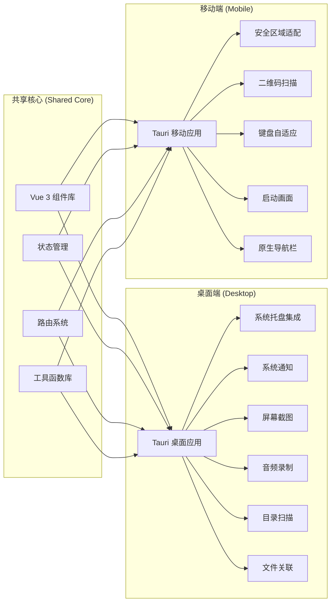

## 3. 核心模块架构

### 3.1 前端模块结构

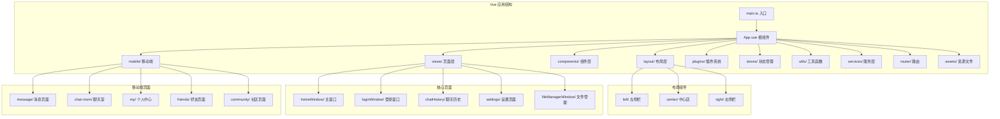

### 3.2 插件系统架构

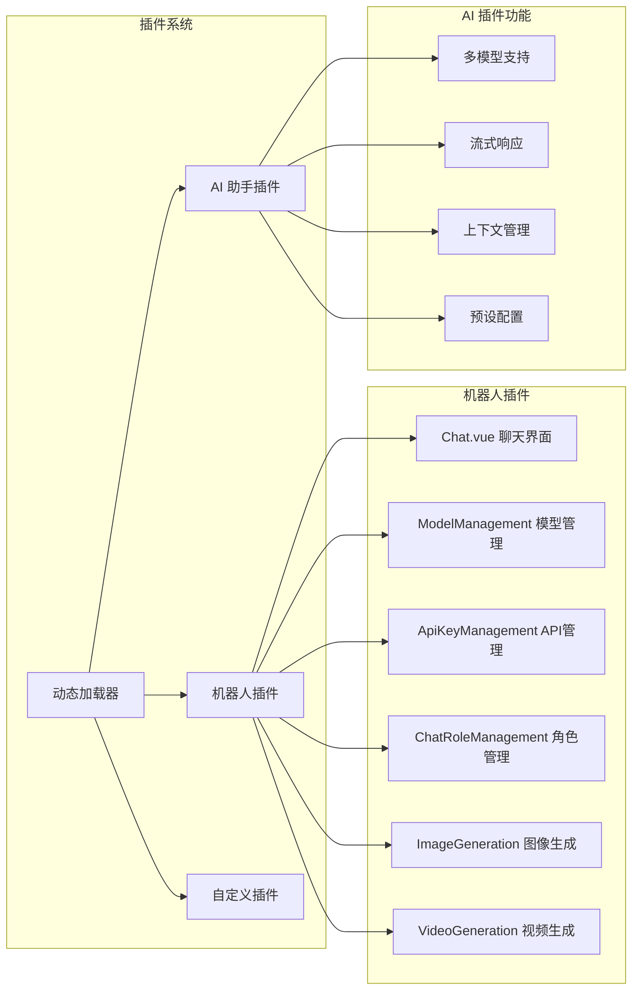

### 3.3 数据库架构

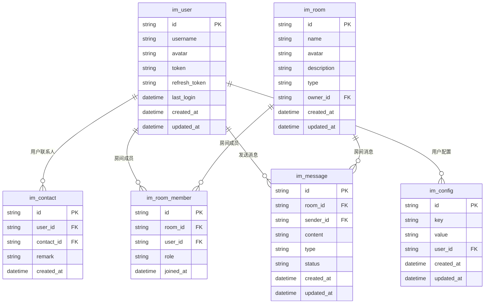

## 4. 通信架构

### 4.1 WebSocket 通信流程

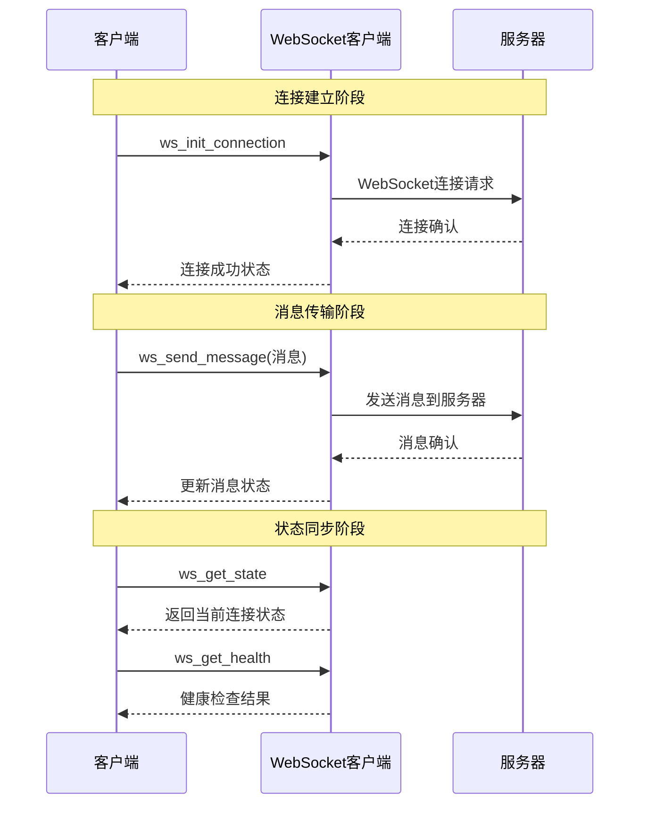

### 4.2 API 请求架构

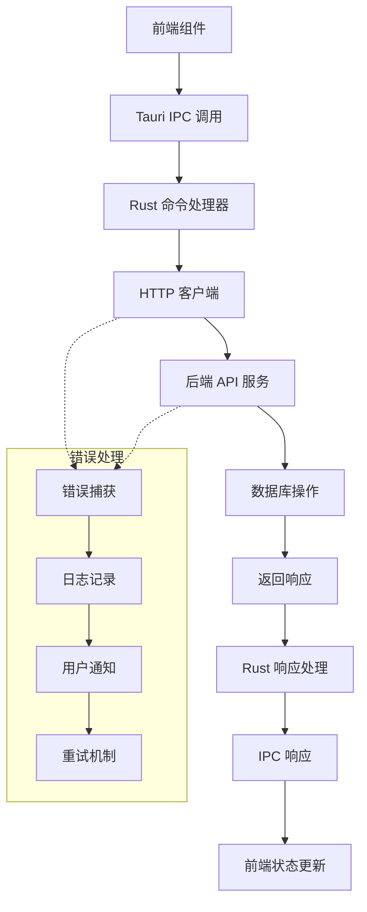

## 5. 状态管理架构

### 5.1 Pinia Store 结构

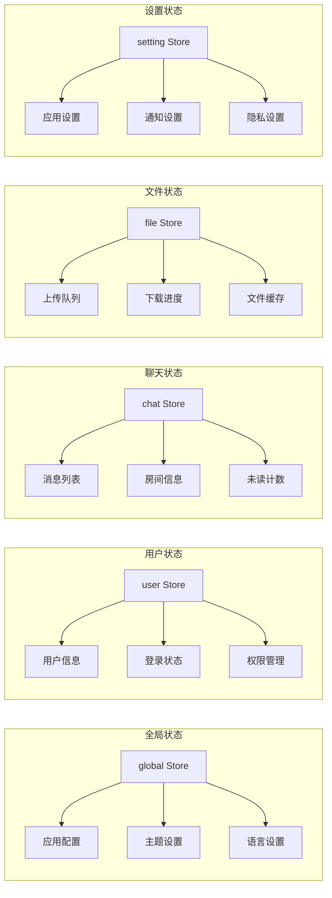

## 6. 安全架构

### 6.1 认证授权流程

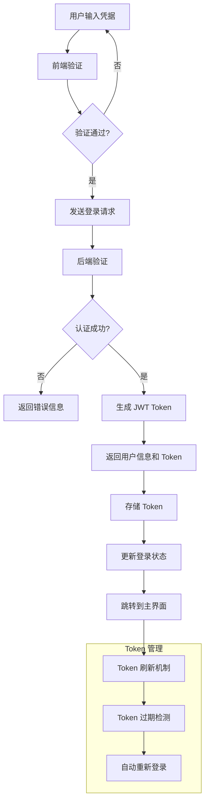

### 6.2 数据安全

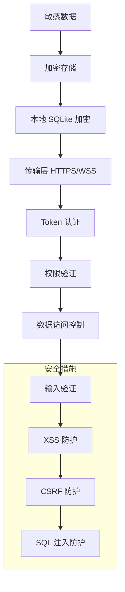

## 7. 性能优化架构

### 7.1 前端性能优化

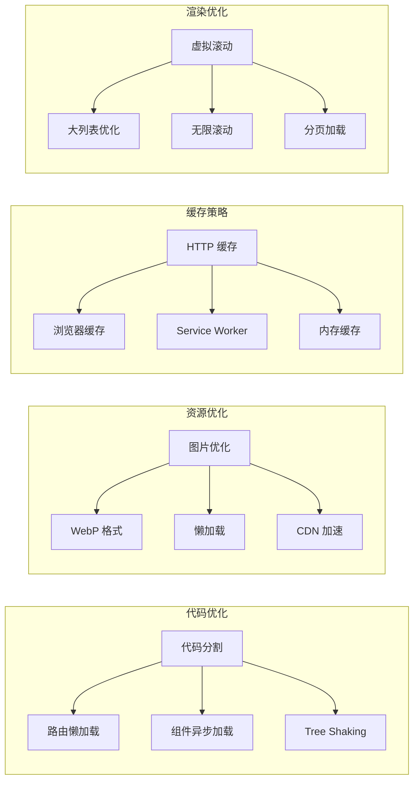

### 7.2 数据库性能优化

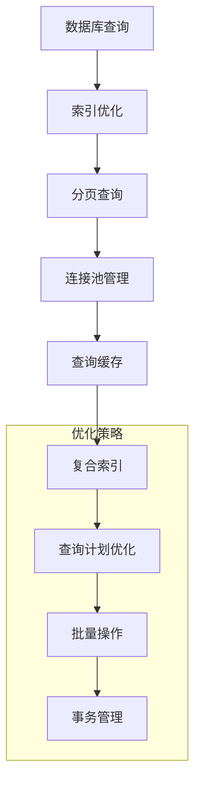

## 8. 部署架构

### 8.1 构建流程

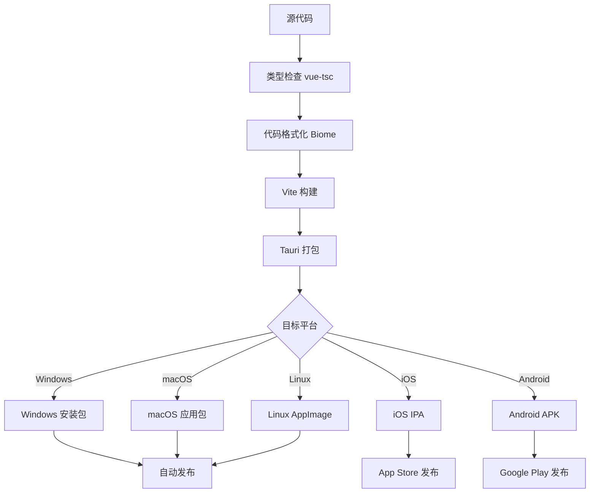

### 8.2 CI/CD 流水线

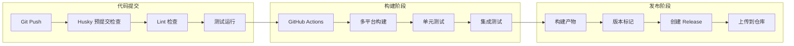

## 9. 监控与日志架构

### 9.1 日志系统

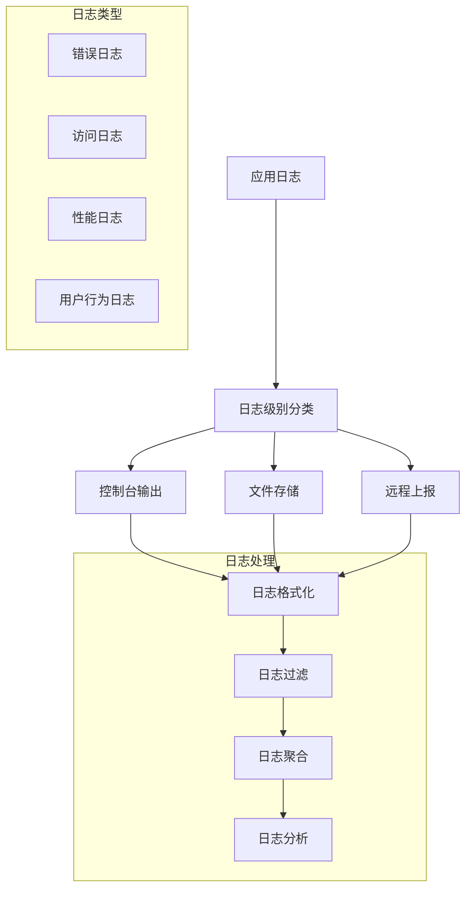

### 9.2 性能监控

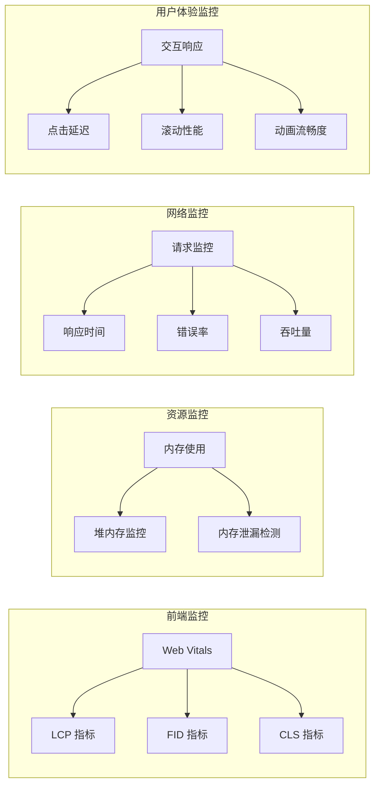

## 10. 扩展性架构

### 10.1 插件扩展机制

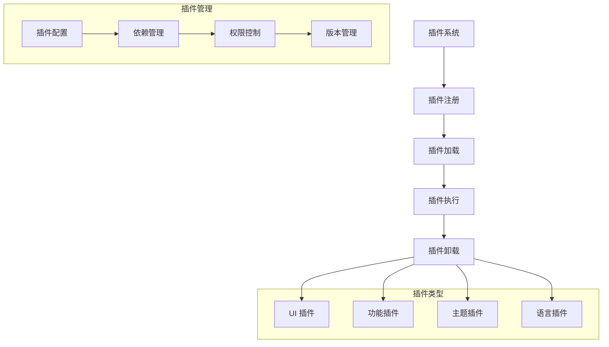

### 10.2 多平台适配

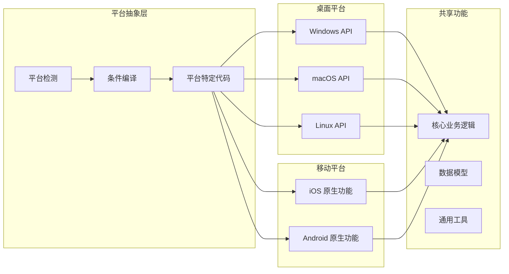

## 11. 总结

HuLa 系统采用现代化的跨平台架构设计，通过 Tauri 框架实现了高性能的桌面和移动端应用。系统具备以下特点：

1. **跨平台统一**: 单一代码库支持多平台部署
2. **高性能**: Rust 后端 + Vue 前端的优化组合
3. **模块化设计**: 清晰的分层架构和插件系统
4. **安全可靠**: 完善的认证授权和数据保护机制
5. **易于维护**: 良好的代码组织和文档体系
6. **可扩展性**: 灵活的插件系统和平台适配机制

该架构为即时通讯应用提供了坚实的技术基础，支持未来的功能扩展和性能优化需求。